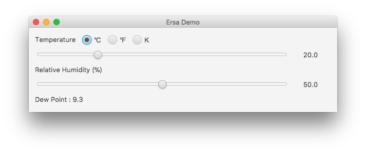

# Ersa
Dew point calculation library

[](https://jitpack.io/#Pygmalion69/Ersa) [](https://travis-ci.org/Pygmalion69/Ersa)

### Gradle

Add the JitPack repository in your root build.gradle at the end of repositories:

```
repositories {
    maven {
        url 'https://www.jitpack.io'
    }
}
```

Add the dependency:

```
dependencies {
    compile 'com.github.Pygmalion69:Ersa:0.4'
}
```

### Example

```java
Temperature temperature = new Temperature(20, Scale.CELSIUS);
Temperature dewPoint = new Temperature(Scale.CELSIUS);
double relativeHumidity = 60;

Dew dew = new Dew();

double kelvin = temperature.getKelvin();
dewPoint.setKelvin(dew.dewPoint(relativeHumidity, kelvin));
double dewPointC = dewPoint.getTemperature();
```

### Demo

A demo is included in the project.



